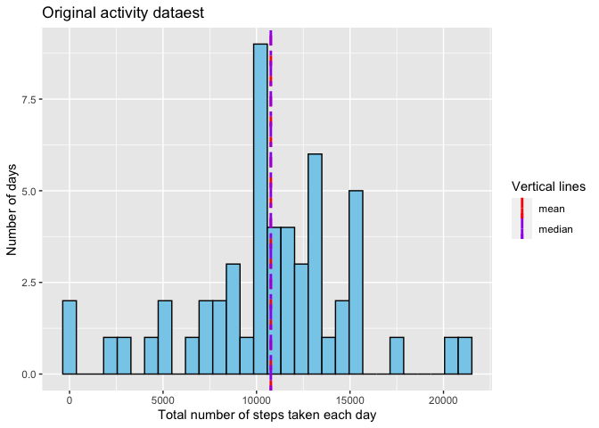
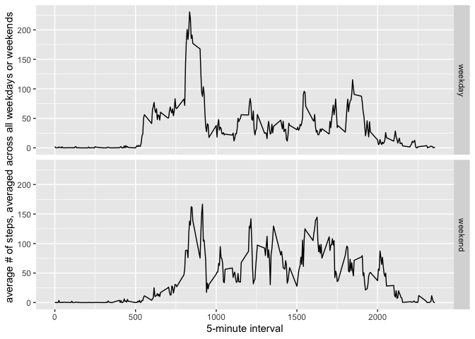

---
title:
author: Reza Hosseini
output: 
  html_document: 
    keep_md: yes
    toc: yes
    toc_float:
      collapsed: no
      smooth_scroll: yes
---

## Reproducible Research: Peer Assessment 1  

   
### Loading and preprocessing the data  
  
**1. Load the data**


```r
unzip("activity.zip")

library("tidyverse")
```

```
## ── Attaching packages ─────────────────────────────────────────── tidyverse 1.3.0 ──
```

```
## ✓ ggplot2 3.3.2     ✓ purrr   0.3.4
## ✓ tibble  3.0.3     ✓ dplyr   1.0.0
## ✓ tidyr   1.1.0     ✓ stringr 1.4.0
## ✓ readr   1.3.1     ✓ forcats 0.5.0
```

```
## ── Conflicts ────────────────────────────────────────────── tidyverse_conflicts() ──
## x dplyr::filter() masks stats::filter()
## x dplyr::lag()    masks stats::lag()
```

```r
activity <- read_csv("activity.csv")
```

```
## Parsed with column specification:
## cols(
##   steps = col_double(),
##   date = col_date(format = ""),
##   interval = col_double()
## )
```


  
**2. Process/transform the data (if necessary) into a format suitable for your 
analysis**  
I didn't need to transform the data.


  
_______________________________________________________________________________
### What is mean total number of steps taken per day?

**1. Make a histogram of the total number of steps taken each day**

```r
totalSteps <- activity %>% 
                group_by(date) %>% 
                  summarize(total = sum(steps))
```

```
## `summarise()` ungrouping output (override with `.groups` argument)
```

```r
ggplot(data = totalSteps, aes(x = total)) +
  geom_histogram(color = "black", fill = "skyblue") +
  ggtitle("Original activity dataest") +
  xlab("Total number of steps taken each day") +
  ylab("Number of days") +
  geom_vline(aes(xintercept = mean(total, na.rm = TRUE), color = "mean"),
             size = 1,
             linetype = "dashed") +
  geom_vline(aes(xintercept = median(total, na.rm = TRUE), color = "median"),
             size = 1,
             linetype = "twodash") +
  scale_color_manual(name = "Vertical lines",
                     values = c("red", "purple"))
```

```
## `stat_bin()` using `bins = 30`. Pick better value with `binwidth`.
```

```
## Warning: Removed 8 rows containing non-finite values (stat_bin).
```

<!-- -->


  
**2. Calculate and report the mean and median total number of steps taken per day**


```r
totalSteps %>% 
  summarize(mean = mean(total, na.rm = TRUE),
            median = median(total, na.rm = TRUE))
```

```
## # A tibble: 1 x 2
##     mean median
##    <dbl>  <dbl>
## 1 10766.  10765
```


  
_______________________________________________________________________________  
### What is the average daily activity pattern?

**1. Make a time series plot (i.e. type = "l") of the 5-minute interval (x-axis) 
and the average number of steps taken, averaged across all days (y-axis)**


```r
averageSteps <- activity %>% 
                  group_by(interval) %>% 
                    summarize(average = mean(steps, na.rm = TRUE))
```

```
## `summarise()` ungrouping output (override with `.groups` argument)
```

```r
ggplot(data = averageSteps, aes(x = interval, y = average)) +
  geom_line() +
  xlab("5-minute interval") +
  ylab("average number of steps taken, averaged across all days")
```

<!-- -->

  
**2. Which 5-minute interval, on average across all the days in the dataset, 
contains the maximum number of steps?**


```r
averageSteps %>% 
  filter(average == max(average)) %>% 
    select(interval)
```

```
## # A tibble: 1 x 1
##   interval
##      <dbl>
## 1      835
```


  
_______________________________________________________________________________
### Imputing missing values

**1. Calculate and report the total number of missing values in the dataset (i.e. 
the total number of rows with NAs)**


```r
sapply(activity, function(x) {sum(is.na(x))})
```

```
##    steps     date interval 
##     2304        0        0
```

  
**2. Devise a strategy for filling in all of the missing values in the dataset. 
The strategy does not need to be sophisticated. For example, you could use the 
mean/median for that day, or the mean for that 5-minute interval, etc.**  

I chose to impute each missing value with the mean for that 5-minute interval. 
I have previously calculated that in the "What is the average daily activity 
pattern?" question above (*averageSteps* tibble).


  
**3. Create a new dataset that is equal to the original dataset but with the 
missing data filled in.**


```r
activity_imputed <- activity
  
for (i in 1:length(activity$steps)) {
    if (is.na(activity$steps[i])) {
      activity_imputed$steps[i] <-
        averageSteps[averageSteps$interval==activity$interval[i],]$average
    }
}
```


  
**4. Make a histogram of the total number of steps taken each day and Calculate 
and report the mean and median total number of steps taken per day. Do these values
differ from the estimates from the first part of the assignment? What is the impact
of imputing missing data on the estimates of the total daily number of steps?**


```r
totalSteps2 <- activity_imputed %>% 
                group_by(date) %>% 
                  summarise(total = sum(steps))
```

```
## `summarise()` ungrouping output (override with `.groups` argument)
```

```r
ggplot(data = totalSteps2, aes(x = total)) +
  geom_histogram(color = "black", fill = "skyblue") +
  ggtitle("Imputed activity dataest") +
  xlab("Total number of steps taken each day") +
  ylab("Number of days") +
  geom_vline(aes(xintercept = mean(total), color = "mean"),
             size = 1,
             linetype = "dashed") +
  geom_vline(aes(xintercept = median(total), color = "median"),
             size = 1,
             linetype = "twodash") +
  scale_color_manual(name = "Vertical lines",
                     values = c("red", "purple"))
```

```
## `stat_bin()` using `bins = 30`. Pick better value with `binwidth`.
```

<!-- -->

```r
totalSteps2 %>% 
  summarize(mean = mean(total),
            median = median(total))
```

```
## # A tibble: 1 x 2
##     mean median
##    <dbl>  <dbl>
## 1 10766. 10766.
```

The *mean* remained the same as I imputed the missing values with the mean. 
However, the *median* increased just a little (previously it was 10765).

  
_______________________________________________________________________________
### Are there differences in activity patterns between weekdays and weekends?

**1. Create a new factor variable in the dataset with two levels – “weekday” and 
“weekend” indicating whether a given date is a weekday or weekend day.**


```r
activity_imputed <- activity_imputed %>% 
                      mutate(day = weekdays(date))

weekend <- c("Saturday", "Sunday")

for (i in 1:length(activity_imputed$day)) {
    if (activity_imputed$day[i] %in% weekend) {
      activity_imputed$day[i] <- "weekend"
    }
    else {
      activity_imputed$day[i] <- "weekday"
    }
}

activity_imputed$day <- as.factor(activity_imputed$day)
```


  
**2. Make a panel plot containing a time series plot (i.e. type = "l") of the 
5-minute interval (x-axis) and the average number of steps taken, averaged across 
all weekday days or weekend days (y-axis).**


```r
averageSteps2 <- activity_imputed %>% 
                  group_by(day, interval) %>% 
                    summarize(average = mean(steps))
```

```
## `summarise()` regrouping output by 'day' (override with `.groups` argument)
```

```r
ggplot(data = averageSteps2, aes(x = interval, y = average)) +
  geom_line() +
  facet_grid(rows = vars(day)) +
  xlab("5-minute interval") +
  ylab("average # of steps, averaged across all weekdays or weekends")
```

<!-- -->
  
  
  
